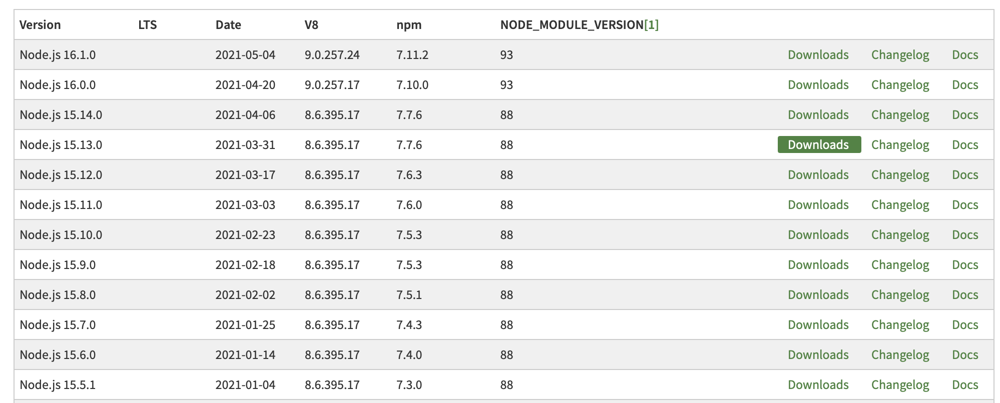

# zpl-printer-backend

## How to run

```bash
node app.js
```

## Installation

### Dependency

https://nodejs.org/en/download/releases/

```bash
"node": v15.11.0
"npm": 7.6.0
"yarn": 1.22.5
```

Note: If you have problem about `Printer Package`

```
npm install printer --target_arch=ia32
npm install printer --target_arch=x64
```

more detail - https://www.npmjs.com/package/printer

## How to install dep of Printer

#### if you cannot install priner package !!!

```bash
npm uninstall printer
```

https://github.com/tojocky/node-printer/issues/302

```bash
npm config ls -l
npm config set legacy-peer-deps=true
npm config get legacy-peer-deps
```

```bash
npm install printer --build-from-source
```

## Administrator: Windows PowerShell

npm install --global --production windows-build-tools

https://gitter.im/tojocky/node-printer?at=59a2ba0a66c1c7c477e77a3c

## Check NODE_MODULES

```bash
<INPUT> $ node -p process.versions.modules
<OUTPUT> 88
```

or

```bash
<INPUT> $ npm version
<OUTPUT>
{
  zpl-printer-backend: '1.0.0',
  npm: '7.4.0',
  node: '15.6.0',
  v8: '8.6.395.17-node.23',
  uv: '1.40.0',
  zlib: '1.2.11',
  brotli: '1.0.9',
  ares: '1.17.1',
  modules: '88',
  nghttp2: '1.42.0',
  napi: '7',
  llhttp: '2.1.3',
  openssl: '1.1.1i',
  cldr: '37.0',
  icu: '67.1',
  tz: '2019c',
  unicode: '13.0'
}
```


